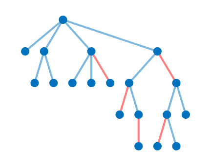

# Dynamic Programming on Trees
從一棵樹上移除一條邊，它就變成兩棵樹；從一棵樹上移除一個度數為\\(d\\)的點，它就變成\\(d\\)棵樹。由於這樣的遞迴性質，不少樹上問題都具有最佳子結構(optimal substructure)，也許就能利用動態規劃(dynamic programming)相關的技巧解出。

當然，就跟傳統DP一樣，不引入例題就無法體會到精髓，所以直接來看幾個經典題。

### Classic Examples
> [CSES - Tree Matching](https://cses.fi/problemset/task/1130)
>
> 給定一棵\\(n\\)個點的樹，找出這棵樹上的最大（邊數）配對，並印出總共有幾個邊。配對的定義是：一個邊集合，其中每個點與至多一條邊相鄰。

許多（無根）樹上問題的第一步，就是隨便選一個點當作根。  


定根之後，來觀察連到根節點的這些邊。根據配對的定義，可能的情形有：
1. 這些邊都不屬於一個（最大）配對。  
     
   此時，把這些邊與根拿走，剩下的圖也是一個配對。  
     
   於是，只要遞迴求出每個子樹的（最大）配對，就能涵蓋這個情形所有可能的配對。這題要求最大配對，所以只要把每個子樹的最大配對合併就是了；總邊數則是每個最大配對的邊數相加。  
   
2. 其中一條邊屬於一個（最大）配對。  
     
   把這些邊與根拿走，剩下的圖還是能保證是一個配對。  
     
   但反過來就不行了，原因也很明顯：假設根是\\(u\\)，而邊\\((u, v)\\)屬於這個配對，就不能再有其它點跟\\(v\\)配對了。  
     
   於是，當遞迴到以\\(v\\)為根的子樹時，只能考慮第1. 種情形的配對；對於其它\\(u\\)的小孩\\(w\neq v\\)，一樣所有可能的配對都可以考慮。

#### Defining a DP State
有了上一節最佳子結構的觀察之後，就能開始設計dp狀態。不妨令\\(dp[1][u]\\)為「以\\(u\\)為根的子樹中，最大配對的邊數」；\\(dp[0][u]\\)的定義差不多，但加入一個限制「\\(u\\)不能是任意配對邊的端點」。  
其實\\(dp[0][u]\\)就是上述第1. 種情形，而\\(dp[1][u]\\)則同時包含兩種情形。
前一節就提過了，寫成數學式的話是：

\\[dp[0][u]=\sum_{v\in child(u)}dp[1][v]\\]

\\(dp[1][u]\\)的轉移式也不複雜，除了最終要與\\(dp[0][u]\\)取較大值外，對\\(u\\)的所有小孩做前一節第2. 種情形，再全部取最大值就可以了。

\\[dp[1][u]=\max\biggl(dp[0][u],\max_{v\in child(u)}\Bigl(1+dp[0][v]+\sum_{w\in child(u),w\neq v}dp[1][w]\Bigr)\biggr)\\]

\\[=\max\biggl(dp[0][u],1+\max_{v\in child(u)}\Bigl(dp[0][v]+\sum_{w\in child(u)}dp[1][w]-dp[1][v]\Bigr)\biggr)\\]

\\[=\max\Bigl(dp[0][u],1+\sum_{v\in child(u)}dp[1][v]+\max_{v\in child(u)}\bigl(dp[0][v]-dp[1][v]\bigr)\Bigr)\\]

#### Implementation Details
筆者習慣0-based indexing，所以樹的輸入會寫成這樣：
```cpp
#define MAXN (int)2e5
// Global array
vector<int> tree[MAXN];
// In main()
for (int i = 1; i < n; ++i) {
    int a, b; cin >> a >> b;  // 1 <= a, b <= MAXN on CSES
    tree[a - 1].push_back(b - 1);
    tree[b - 1].push_back(a - 1);
}
```
接著，隨便選一個點當作根，假設選擇編號為0的點：
```cpp
void DFS(int u, int parent) {
    for (const int &v: tree[u]) if (v != parent)
        DFS(v, u);
}
DFS(0, -1);

```
一個子樹的根可以用這個根節點的編號來代表，所以前一節的dp表會寫成`int dp[2][MAXN];`。

樹DP的轉移通常採用memoization而不是填表，因為要了解一棵樹的整體結構，必定要經過一次（通常是深度優先）搜尋；memoization可以邊DFS邊做，而填表需要先知道轉移順序，也就是需要完整DFS一遍之後才能做，多此一舉。

以下實作中，`tmp`指的是\\(\max_{v\in child(u)}\bigl(dp[0][v]-dp[1][v]\bigr)\\)。  
兩個`for (const int &v: tree[u]) if (v != parent)`迴圈看似會讓複雜度變差，但只有第一個迴圈會遞迴呼叫`DFS`，所以時間複雜度會是好好的\\(\Theta(n)\\)。
```cpp
void DFS(int u, int parent) {
    dp[0][u] = 0;
    for (const int &v: tree[u]) if (v != parent) {
        DFS(v, u);
        dp[0][u] += dp[1][v];
    }
    dp[1][u] = 1; int tmp = -2147483647;
    for (const int &v: tree[u]) if (v != parent) {
        dp[1][u] += dp[1][v];
        tmp = max(tmp, dp[0][v] - dp[1][v]);
    }
    dp[1][u] = max(dp[0][u], dp[1][u] + tmp);
}
```
經過一次DFS之後，因為根的編號為0，所以`dp[1][0]`就是答案。
<details><summary>Solution Code</summary>

```cpp
#include <iostream>
#include <vector>
using namespace std;
#define MAXN (int)2e5
vector<int> tree[MAXN]; int dp[2][MAXN];
void DFS(int u, int parent) {
    dp[0][u] = 0;
    for (const int &v: tree[u]) if (v != parent) {
        DFS(v, u);
        dp[0][u] += dp[1][v];
    }
    dp[1][u] = 1; int tmp = -2147483647;
    for (const int &v: tree[u]) if (v != parent) {
        dp[1][u] += dp[1][v];
        tmp = max(tmp, dp[0][v] - dp[1][v]);
    }
    dp[1][u] = max(dp[0][u], dp[1][u] + tmp);
}
int main() {
    int n; cin >> n;
    for (int i = 1; i < n; ++i) {
        int a, b; cin >> a >> b;
        tree[a - 1].push_back(b - 1);
        tree[b - 1].push_back(a - 1);
    }
    DFS(0, -1);
    cout << dp[1][0] << endl; return 0;
}
```

</details>

> Finding the Diameter and a Center of a Tree
>
> 一張圖的直徑(diameter)為圖中任兩點距離中最長的[^note-1]；圓心(center)則為使一個點與其它點最遠的距離最小的點[^note-2]。對於樹，以圓心為樹根，則樹高會最小[^note-3]。給定一棵\\(n\\)個點的樹，請在\\(\Theta(n)\\)的時間內，找出這棵樹的直徑（長度）以及一個圓心。

## DP on Trees with Rerooting

### "Dynamic Programming" on Trees or "Divide and Conquer" on Trees?

演算法課程會提到，一個可應用DP技巧的問題，一定具有「最佳子結構」跟「重疊子問題」(overlapping subproblems)兩個性質。如果讀者回去看第一節，就會發現筆者並沒有提到「重疊子問題」；事實上，以上所有的例題都沒有重疊子問題的性質。即便一個小子問題的答案被利用多次，它並不是被「多個大子問題」所利用。

那這種技巧憑什麼稱為樹DP？為什麼不叫做樹分治？

其實筆者自己也認為，以上內容應該是樹分治，而不是樹DP。不過，接下來就要介紹一類含有大量重疊子問題，必須用DP來解的問題。

## References
- [DP on Trees - Introduction · USACO Guide](https://usaco.guide/gold/dp-trees?lang=cpp)
- [7. 樹與DP進階 - 2017建中校內培訓講義](https://tioj.ck.tp.edu.tw/uploads/attachment/11/54/7.pdf)
- [DP on Trees - Solving For All Roots · USACO Guide](https://usaco.guide/gold/all-roots?lang=cpp)
- Thomas H. Cormen, Charles E. Leiserson, Ronald L. Rivest, and Clifford Stein.  *Introduction to Algorithms*, third edition, 379, 384.  The MIT Press, 2009.

[^note-1]: [Graph Diameter -- from Wolfram MathWorld](https://mathworld.wolfram.com/GraphDiameter.html)

[^note-2]: [Graph Center -- from Wolfram MathWorld](https://mathworld.wolfram.com/GraphCenter.html)

[^note-3]: [3. 圖論 - 2017建中校內培訓講義](https://tioj.ck.tp.edu.tw/uploads/attachment/11/42/3.pdf)
